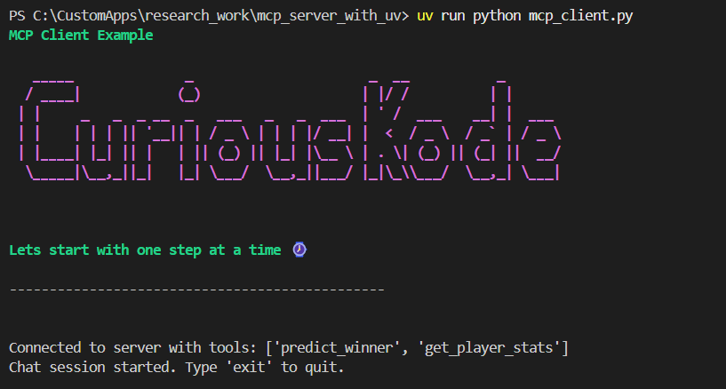
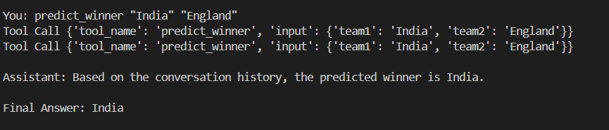
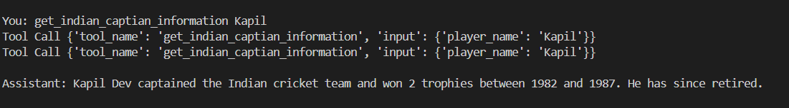

# Cricket Prediction MCP Server

[](https://www.python.org/)
[](https://modelcontextprotocol.io/)
[](https://astral.sh/uv/)





This is a sample [Model Context Protocol (MCP)](https://modelcontextprotocol.io/) server built with Python, demonstrating how to expose tools and resources to LLMs and MCP clients. It also includes a sample MCP client that integrates with Google Gemini.

## Features

- **Predict Winner Tool**: Predicts the winner between two cricket teams (mock logic).
- **Get Player Stats Tool**: Returns mock stats for a cricket player.
- **Get Indian Captian Information Tool**: Returns mock stats or leader stats for a cricket player, including trophies and retirement status.
- **Match Data CSV Resource**: Exposes mock cricket match data as a CSV resource, with support for sampling rows.
- **MCP Client**: Example client using MCP and Google Gemini (API key required).

## Setup

1. **Install [uv](https://astral.sh/uv/):**
   ```sh
   # Follow instructions at https://astral.sh/uv/
   ```
2. **Install dependencies:**
   ```sh
   uv venv
   uv add "mcp[cli]" httpx pre-commit
   ```
3. **Set up your Google Gemini API key:**
   - Create a `.env` file in the project root with the following content:
     ```env
     GEMINI_KEY=your-gemini-api-key-here
     ```

## Pre-commit Hooks

Set up pre-commit hooks to ensure code quality:

1. **Install pre-commit hooks:**
   ```sh
   uv run pre-commit install
   ```
2. **Run all pre-commit hooks manually:**
   ```sh
   uv run pre-commit run --all
   ```

## Running the Server

Run the MCP server (now named `mcp_server.py`):
```sh
uv run mcp dev mcp_server.py
```

## Running the Client

Run the MCP client (requires `.env` with Gemini API key):
```sh
uv run python mcp_client.py
```

## Usage

This server exposes the following MCP tools and resources:

### Tools
- `predict_winner(team1: str, team2: str) -> str`: Predicts the winner between two teams (mock).
- `get_player_stats(player_name: str) -> str`: Returns mock stats for a player.
- `get_indian_captian_information(player_name: str) -> str`: Returns stats for a cricket player an indian captian, including trophies won, years range, and retirement status. If the player does not exist, returns a not-exist message.

### Resources
- `match_data_csv(sampling: int = None) -> str`: Returns mock match data as CSV. If `sampling` is provided, returns that many random rows (plus header).

## About MCP

Model Context Protocol (MCP) standardizes how applications provide context and tools to LLMs. Learn more at [modelcontextprotocol.io](https://modelcontextprotocol.io/).

---

This project is for demonstration purposes only and uses mock data and logic.